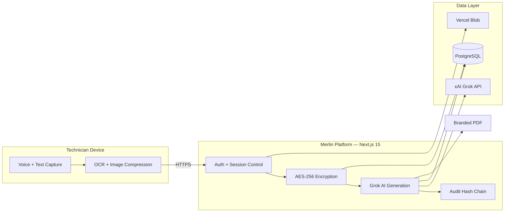

# Merlin — Mercedes-Benz Warranty Story Generator

**Secure AI-Powered Warranty Documentation for Mercedes-Benz Dealerships**

[](https://nextjs.org/)
[](https://www.typescriptlang.org/)
[](https://www.prisma.io/)
[](https://github.com/Nicequantum/viti-ai-clone)

Merlin helps Mercedes-Benz technicians produce accurate, professional warranty narratives using Grok AI. Built for Fixed Operations teams, it combines voice-first capture, server-side encryption, and a tamper-evident audit trail — so dealerships can move faster without sacrificing compliance.

---

## Who This Is For

| Role | What You Get |
|------|--------------|
| **Technicians** | Voice-to-story workflow, stable shop-floor editing, one-click PDF export |
| **Service Managers** | Dealership-wide visibility, user administration, audit log with hash-chain verification |
| **Fixed Ops Directors** | Enterprise security controls, session revocation, and compliance-ready documentation |

---

## Key Features

- Voice input with real-time transcription and cursor preservation
- Grok AI–generated professional warranty narratives
- AES-256-GCM encryption at rest for sensitive customer, vehicle, and story data
- Tamper-evident SHA-256 hash-chained audit trail
- Client-side image compression with private blob storage
- Professional branded PDF generation
- Role-based access with instant session revocation
- Stable UI patterns designed for high-pressure shop-floor use

---

## Security & Compliance

| Control | Detail |
|---------|--------|
| **Encryption at rest** | AES-256-GCM on customer name, VIN, complaints, technician notes, OCR text, diagnostic data, and warranty stories |
| **Session security** | JWT with server-side revocation on password change, deactivation, or logout |
| **Audit integrity** | Append-only log with per-dealership SHA-256 hash chain |
| **Image access** | Private Vercel Blob storage; served only through session-gated API proxy |
| **AI safety** | Audit-safe prompts use `[NOT DOCUMENTED]` / `[NOT PROVIDED]` — no fabricated test data |
| **Rate limiting** | Distributed rate limiting via Vercel KV in production |

> **Production requirement:** A signed Data Processing Agreement (DPA) with xAI must be in place before processing real customer or vehicle data.

---

## Architecture Overview



---

## How It Works

1. Technician logs in and opens a repair order
2. Captures complaints, diagnostics, and notes via voice or manual entry
3. Data is transmitted over HTTPS; sensitive fields are encrypted server-side before storage
4. Merlin builds a secure prompt and sends it to Grok AI
5. A professional warranty narrative is generated and logged
6. Every action is recorded in the hash-chained audit trail
7. Technician reviews, edits if needed, and exports a branded PDF

---

## Common Failure Modes & Troubleshooting

| Issue | Symptom | Fix |
|-------|---------|-----|
| **Grok Timeout** | Long loading spinner or timeout message | Shorten input, wait 15 seconds, click **Regenerate** |
| **Voice Input** | Microphone does not respond | Allow microphone permission in Chrome or Edge |
| **PDF Failed** | "Failed to generate PDF" | Fill all required fields, regenerate story, then retry |
| **Frequent Logouts** | Unexpected session expiry | Verify device clock; clear browser cache |
| **Audit Chain Warning** | Integrity error in audit log | Stop use; notify Service Manager and IT immediately |

---

## Getting Started

```bash
git clone https://github.com/Nicequantum/viti-ai-clone.git
cd viti-ai-clone
npm install
cp .env.example .env.local
npm run db:migrate:deploy
npm run dev
```

| Variable | Required | Purpose |
|----------|----------|---------|
| `DATABASE_URL` | Yes | PostgreSQL connection |
| `SESSION_SECRET` | Yes | Session signing key |
| `ENCRYPTION_KEY` | Yes | AES-256-GCM key (64 hex chars) |
| `GROK_API_KEY` | For AI | xAI API key (server-side only) |
| `BLOB_READ_WRITE_TOKEN` | For uploads | Private image storage |
| `ADMIN_SEED_PASSWORD` | For seed | Initial manager password |

Open [http://localhost:3000](http://localhost:3000) after setup.

---

## Production Deployment

Optimized for **Vercel + PostgreSQL**. Deploy branch `main`, set all variables from `.env.example`, and verify `GET /api/health` returns `"status": "ok"`.

### Pre-Production Checklist

- [ ] Environment variables configured on host
- [ ] `npm run db:migrate:deploy` completed
- [ ] `npm run db:reencrypt` run if upgrading an existing database
- [ ] Seed/default passwords rotated
- [ ] Audit log hash-chain integrity **VALID**
- [ ] xAI DPA executed
- [ ] CI passing on `main`

---

## Repository

[github.com/Nicequantum/viti-ai-clone](https://github.com/Nicequantum/viti-ai-clone)

Built for Mercedes-Benz dealerships that need both speed and compliance.

**License:** Proprietary — authorized Mercedes-Benz dealership use only.